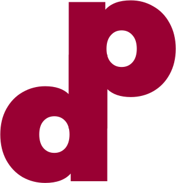

[](https://github.com/AjibsBaba/diabetes-diagnosis/actions/workflows/cicd.yml)

<!-- PROJECT LOGO -->
<br />
<p align="center">
  <a href="https://github.com/AjibsBaba/diabetes-diagnosis">
    
  </a>

<h1 align="center">Diabetes Prediction App</h1>


<!-- ABOUT THE PROJECT -->

This is my first Data Science project deployed on the web. It is a supervised learning study that leverages an ensemble
method that combines different classifiers such as Logistic Regression, Random Forest, AdaBoost, Gradient Boosting,
KNeighbours, Decision tree, and SVC. The Major goal of this study was to create a web-based interface to run inference
on a machine learning model. The Web application developed with the flask framework helps to predict if a person has
Diabetes mellitus or not via a web-based form.

### Development Tools

This section outlines some libraries used in this project; other libraries not listed here can be found in
the ```requirements.txt``` file.

* [Flask](https://flask.palletsprojects.com/en/1.1.x/)
* [Scikit-learn](https://scikit-learn.org/stable)
* [Numpy](https://numpy.org/)
* [Pandas](https://pandas.pydata.org/)

<!-- GETTING STARTED -->

## Running Locally

This is a guide to help you set up the project locally. This guide assumes that you have Python 3 installed on your
machine
or computer

```sh
flask run
```

### Installation

• Clone the repo

```sh
git clone https://github.com/AjibsBaba/diabetes-diagnosis.git
```

• Install PIP packages

```sh
pip install -r requirements.txt
```

"
• In the root directory of the project type the command "flask run" highlighted below.

```sh
flask run
```

<!-- LICENSE -->

## License

MIT License

Copyright (c) 2020 Samuel Ajibade

Permission is hereby granted, free of charge, to any person obtaining a copy
of this software and associated documentation files (the "Software"), to deal
in the Software without restriction, including without limitation the rights
to use, copy, modify, merge, publish, distribute, sublicense, and/or sell
copies of the Software, and to permit persons to whom the Software is
furnished to do so, subject to the following conditions:

The above copyright notice and this permission notice shall be included in all
copies or substantial portions of the Software.

THE SOFTWARE IS PROVIDED "AS IS", WITHOUT WARRANTY OF ANY KIND, EXPRESS OR
IMPLIED, INCLUDING BUT NOT LIMITED TO THE WARRANTIES OF MERCHANTABILITY,
FITNESS FOR A PARTICULAR PURPOSE AND NONINFRINGEMENT. IN NO EVENT SHALL THE
AUTHORS OR COPYRIGHT HOLDERS BE LIABLE FOR ANY CLAIM, DAMAGES OR OTHER
LIABILITY, WHETHER IN AN ACTION OF CONTRACT, TORT OR OTHERWISE, ARISING FROM,
OUT OF OR IN CONNECTION WITH THE SOFTWARE OR THE USE OR OTHER DEALINGS IN THE
SOFTWARE.


<!-- ACKNOWLEDGEMENTS -->

## Data Source

[UC Irvine Machine Learning Repository!](https://archive.ics.uci.edu/ml/index.php)


[forks-url]: https://github.com/AjibsBaba/diabetes-diagnosis/network/members

[stars-url]: https://github.com/AjibsBaba/diabetes-diagnosis/stargazers

[issues-shield]: https://img.shields.io/github/issues/othneildrew/Best-README-Template.svg?style=flat-square

[issues-url]: https://github.com/AjibsBaba/diabetes-diagnosis/issues

[license-shield]: https://img.shields.io/github/license/othneildrew/Best-README-Template.svg?style=flat-square

[license-url]: https://github.com/AjibsBaba/diabetes-diagnosis/blob/main/LICENSE

[linkedin-shield]: https://img.shields.io/badge/-LinkedIn-black.svg?style=flat-square&logo=linkedin&colorB=555

